# Paramanu

Design systems promise consistency and velocity, but most implementations force a hard choice: adopt a framework-coupled component library (Chakra, MUI, Radix) and accept the lock-in, or maintain raw CSS that drifts between projects. Teams running multiple frameworks — or migrating between them — end up duplicating component logic across bindings. Paramanu takes a different path: CSS-first components with a dual API (BEM class strings for any template engine or CDN, CSS Modules for bundler-based tree shaking), a three-tier token system for deep theming, and thin framework adapters that are generated rather than hand-written. The result is a design system where the styling layer is the source of truth, not the JavaScript framework.

Published as 22 packages under the `@paramanu/*` npm scope, Paramanu targets WCAG 2.2 AA compliance as a core constraint — not an afterthought addon. Built-in themes (Material, Ant Design, Bootstrap, Light Modern, Dark Modern) demonstrate that the token architecture handles real-world brand mappings, not just color swaps.

## Overview

<figure>


<figcaption>Paramanu's layered architecture: design tokens (Level 0) flow into layout primitives and typography (Level 1), which compose into domain components (Level 2) and complex overlays (Level 3). React adapters and CDN bundles sit at the edges as consumers, not owners, of the styling layer.</figcaption>
</figure>

## What It Does

Paramanu provides a complete component library across 11 functional categories — primitives, typography, buttons, forms, navigation, data display, feedback, disclosure, overlays, and utilities — each published as a standalone npm package with its own CSS and class builder.

**Dual API for every component.** Each component exposes two consumption modes from the same source:

- **BEM class builders** (`btnClasses({ variant: "danger", size: "lg" })` returns `"pm-btn pm-btn--danger pm-btn--lg"`) — use these in any templating language, server-rendered HTML, or CDN-based projects. No build step required.
- **CSS Module class builders** (`btnModuleClasses(styles, { variant: "danger" })`) — use these with bundlers that process CSS modules for scoped, collision-free class names with tree shaking.

**Three-tier design token system.** Tokens flow through three layers, each compilable independently via Style Dictionary:

1. **Primitive tokens** — Raw values: colors (full palette), spacing scale, typography scale, border radii, shadows.
2. **Semantic tokens** — Purpose-mapped: `--pm-color-bg`, `--pm-color-fg`, `--pm-color-border`, with automatic light/dark mode via CSS `light-dark()`.
3. **Component tokens** — Per-component overrides: `--pm-btn-bg`, `--pm-btn-radius`, `--pm-btn-padding`. Themes override at this level to restyle components without touching CSS rules.

**Framework adapters.** React adapters wrap each component with `forwardRef`, mapping component props to class builder calls. The adapter pattern is intentionally thin — the `-react` packages are consumers of `-js` packages, not reimplementations.

## Why It Exists

Most design systems are born inside a specific framework. Chakra UI, MUI, and Radix Primitives are React-first — their styling, state management, and accessibility logic live in React hooks and components. This works until:

**The framework changes.** A migration from React to another framework means rewriting every component. The design system's value — consistency, accessibility, tested behavior — doesn't transfer.

**Multiple frameworks coexist.** Large organizations running React in one product and Vue or plain HTML in another can't share a Chakra component library. They end up maintaining parallel implementations that inevitably drift.

**CSS is not the source of truth.** When styling logic lives in JavaScript (CSS-in-JS, styled-components, Tailwind utility classes in JSX), the CSS becomes an artifact of the framework layer. Extracting it for a different consumer — an email template, a static page, a web component — requires reverse-engineering the styling from the JS.

Paramanu inverts this: CSS is the source of truth. Components are defined as CSS rules organized in `@layer pm.components`, with BEM class names as the public API. JavaScript class builders are type-safe mappers from props to class strings — they don't contain styling logic. This means:

- A React app imports `@paramanu/buttons-react` and gets a typed `<Btn>` component.
- A server-rendered Astro page calls `btnClasses()` directly and applies the same styles.
- A CDN consumer loads a single IIFE bundle and writes `class="pm-btn pm-btn--primary"` in HTML.

All three consume the same CSS. No divergence.

## How It Works

### CSS Layer Architecture

All Paramanu styles are scoped within CSS `@layer` declarations following a strict ordering:

```css title="layer-order.css"
@layer pm.reset, pm.tokens, pm.base, pm.components, pm.utilities;
```

This guarantees that component styles override base styles, utility overrides beat component defaults, and consumer styles (outside any `@layer`) always win. The layer model eliminates specificity wars and makes theme overrides predictable.

### Token Compilation Pipeline

Tokens are authored in the W3C Design Token Community Group (DTCG) format as JSON files. Style Dictionary compiles these into:

- **CSS custom properties** — Injected into `:root` and scoped via `[data-theme]` attribute selectors.
- **JavaScript exports** — Named constants for programmatic use in class builders and tests.
- **Theme overrides** — Each theme (Material, Ant Design, Bootstrap, Light Modern, Dark Modern) provides its own token JSON that maps to the same semantic and component token names, producing a CSS file that re-declares custom properties under its `[data-theme]` scope.

Light/dark mode uses the CSS `light-dark()` function at the semantic token level, eliminating media query duplication and enabling per-component color scheme control.

### Class Builder Pattern

Every component's class builder is a pure function: props in, class string out. No side effects, no DOM access, no framework coupling.

```typescript title="button.classes.ts"
export function btnClasses(options: BtnClassesOptions = {}): string {
  const { variant = "default", size = "md", disabled, loading } = options;
  return [
    "pm-btn",
    `pm-btn--${variant}`,
    `pm-btn--${size}`,
    disabled && "pm-btn--disabled",
    loading && "pm-btn--loading",
  ].filter(Boolean).join(" ");
}
```

The CSS Module variant takes an imported `styles` map as the first argument and resolves class names through it, producing hashed class names for bundler consumers while maintaining the same prop-to-class mapping logic.

### Build Pipeline

Each package follows a two-stage build:

1. **CSS stage** — A `css.build.ts` script processes `.css` and `.module.css` files through lightningcss for minification, autoprefixing, and CSS Module hash generation.
2. **JS stage** — tsup bundles TypeScript class builders, types, and React wrappers into ESM output.

Turborepo orchestrates the full monorepo build with dependency-aware parallelism. The CDN package runs last, bundling all CSS and JS into a single IIFE via esbuild.

## Key Features

| Feature | Description |
| --- | --- |
| **CSS-first architecture** | Styling logic lives in CSS `@layer` declarations, not in JavaScript. Class builders are thin mappers, not style generators |
| **Dual API** | BEM classes for templates/CDN + CSS Modules for bundlers — same props, same styles, different consumption modes |
| **Three-tier tokens** | Primitive, semantic, and component-level tokens compiled from DTCG JSON via Style Dictionary |
| **Five built-in themes** | Material, Ant Design, Bootstrap, Light Modern, and Dark Modern — proving the token architecture handles real brand systems |
| **WCAG 2.2 AA** | Accessibility baked into component CSS and tested with vitest-browser + axe-core. Focus management, ARIA patterns, and color contrast are first-class |
| **Tree-shakeable imports** | Import only the components you use: `@paramanu/buttons-js/css/button` loads just button CSS |
| **Framework-agnostic core** | React adapters shipped now; Vue, Svelte, Angular adapters follow the same thin `forwardRef` + class builder pattern |
| **CDN-ready bundle** | Single IIFE file with all CSS and JS for projects without a build step |
| **lightningcss processing** | Fast CSS compilation with automatic vendor prefixing and CSS Module hash generation |
| **Storybook playgrounds** | Separate Storybook instances for React components (port 6006) and vanilla HTML (port 6007) |

## Getting Started

Install the token foundation and the component packages you need:

```bash title="install.sh"
# Tokens + buttons (minimal)
pnpm add @paramanu/tokens @paramanu/buttons-js

# With React adapter
pnpm add @paramanu/tokens @paramanu/buttons-js @paramanu/buttons-react

# Full component set
pnpm add @paramanu/tokens @paramanu/primitives-js @paramanu/typography-js @paramanu/buttons-js @paramanu/forms-js @paramanu/navigation-js @paramanu/data-display-js @paramanu/feedback-js @paramanu/overlays-js
```

Import the CSS layer order and tokens first, then component CSS:

```typescript title="main.ts"
// Foundation (must be first)
import "@paramanu/tokens/css/layer-order";
import "@paramanu/tokens/css/reset";
import "@paramanu/tokens/css";

// Optional: theme (e.g., Material)
import "@paramanu/tokens/css/themes";

// Component CSS
import "@paramanu/buttons-js/css";
```

Use with React:

```tsx title="App.tsx" collapse={1-2}
import { Btn } from "@paramanu/buttons-react";
import { Flex } from "@paramanu/primitives-react";

function App() {
  return (
    <Flex gap="md" align="center">
      <Btn variant="primary" size="lg" onClick={handleSave}>
        Save
      </Btn>
      <Btn variant="outline" leftIcon={<SearchIcon />}>
        Search
      </Btn>
      <Btn loading loadingText="Submitting...">
        Submit
      </Btn>
    </Flex>
  );
}
```

Use without a framework:

```html title="index.html"
<link rel="stylesheet" href="paramanu-bundle.css" />
<script src="paramanu-bundle.iife.js"></script>

<button class="pm-btn pm-btn--primary pm-btn--lg">Save</button>
<button class="pm-btn pm-btn--outline">
  <span class="pm-btn-icon">🔍</span> Search
</button>
```

Apply a theme by setting a `data-theme` attribute:

```html title="theming.html"
<!-- Ant Design theme -->
<body data-theme="antd">
  <button class="pm-btn pm-btn--primary">Ant Design styled</button>
</body>

<!-- Material theme for a section -->
<section data-theme="material">
  <button class="pm-btn pm-btn--primary">Material styled</button>
</section>
```

## Appendix

### Tech Stack

| Component | Technology |
| --- | --- |
| **Language** | TypeScript 5.x (strict mode) |
| **Styling** | CSS custom properties, `@layer`, `light-dark()`, BEM methodology |
| **Token compiler** | Style Dictionary (DTCG format) |
| **CSS processing** | lightningcss (minification, autoprefixing, CSS Modules) |
| **JS bundler** | tsup (ESM output) + esbuild (CDN IIFE bundle) |
| **Monorepo** | pnpm workspaces + Turborepo |
| **Testing** | Vitest 4.x + @vitest/browser + Playwright + axe-core |
| **Documentation** | Astro 5.x + Starlight |
| **Component dev** | Storybook 10.x (React + vanilla HTML instances) |
| **Code quality** | ESLint 9.x + Prettier |
| **React support** | React 18.x–19.x (peer dependency) |

### References

- [Paramanu GitHub Repository](https://github.com/sujeet-pro/paramanu)
- [Paramanu on npm](https://www.npmjs.com/org/paramanu)
- [W3C Design Token Community Group Format](https://design-tokens.github.io/community-group/format/)
- [Style Dictionary](https://amzn.github.io/style-dictionary/)
- [lightningcss](https://lightningcss.dev/)
- [CSS `@layer` Specification](https://www.w3.org/TR/css-cascade-5/#layering)
- [CSS `light-dark()` Function](https://developer.mozilla.org/en-US/docs/Web/CSS/color_value/light-dark)
- [WCAG 2.2 — W3C Recommendation](https://www.w3.org/TR/WCAG22/)
- [BEM Methodology](https://getbem.com/)
